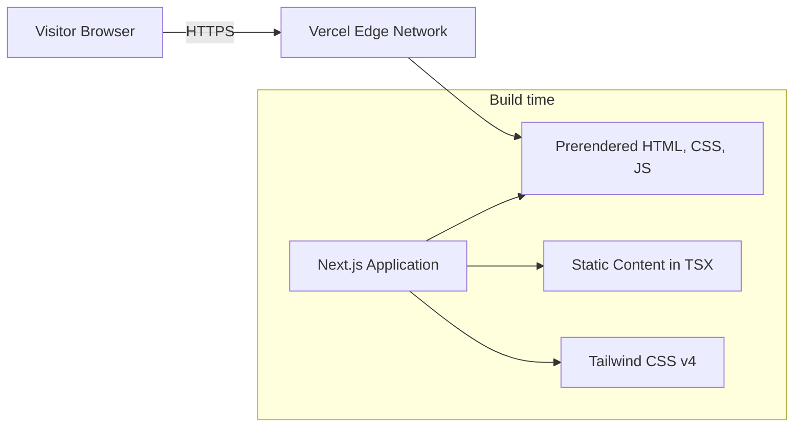
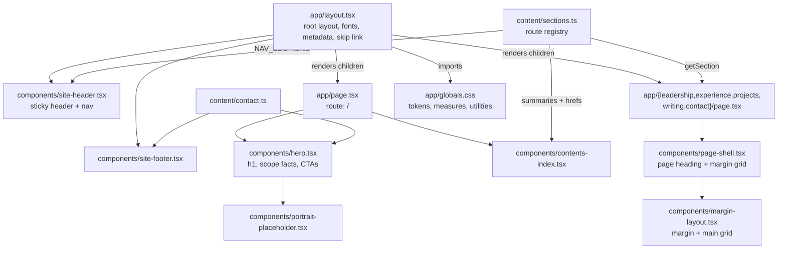
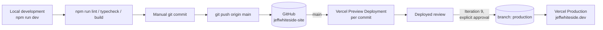

# Architecture

This document describes the architecture **as it currently exists**, not as it is planned.
It is updated in the same iteration as any architectural change.

Current state: **Iteration 2 — site skeleton.** Six routes, header, footer, and navigation
exist. Every section page renders labeled placeholder content; no final copy is written.

## System context

The site is a static, self-contained document. It has no backend of its own, reads no
database, and calls no external service at runtime.

Outbound links to LinkedIn, email, GitHub, and live project applications are introduced in
later iterations and will be added to this diagram when they exist.

## Technology stack

| Layer      | Choice                     | Version |
| ---------- | -------------------------- | ------- |
| Framework  | Next.js (App Router)       | 16.3.0  |
| UI runtime | React                      | 19.2.8  |
| Language   | TypeScript (`strict: true`)| 5.x     |
| Styling    | Tailwind CSS               | 4.x     |
| Linting    | ESLint (flat config)       | 9.x     |
| Hosting    | Vercel                     | —       |

There are exactly three runtime dependencies: `next`, `react`, `react-dom`. Everything else
is a development dependency. See [adr/0001-use-nextjs.md](adr/0001-use-nextjs.md) and
[adr/0002-use-tailwind-css.md](adr/0002-use-tailwind-css.md).

## Rendering approach

All pages are **statically prerendered at build time** (SSG). There is no per-request
rendering, no data fetching, and no runtime environment configuration.

Every component is a **React Server Component**. No `"use client"` boundary exists yet. This
is a deliberate default: client components will be introduced only where interactivity
genuinely requires them, keeping the shipped JavaScript minimal.

Because the output is static HTML, the site can be served entirely from Vercel's CDN.

## Routing approach

The App Router is used with **six routes**, all statically prerendered.

| Route         | File                          | Purpose                       |
| ------------- | ----------------------------- | ----------------------------- |
| `/`           | `app/page.tsx`                | Cover: hero + contents index  |
| `/leadership` | `app/leadership/page.tsx`     | Leadership focus              |
| `/experience` | `app/experience/page.tsx`     | Selected experience           |
| `/projects`   | `app/projects/page.tsx`       | Projects                      |
| `/writing`    | `app/writing/page.tsx`        | Writing and publication       |
| `/contact`    | `app/contact/page.tsx`        | Contact                       |

- `src/app/layout.tsx` is the **root layout**. It renders `<html>` and `<body>`, loads the
  fonts, imports the global stylesheet, renders the header and footer, and exports the site
  `metadata`. Every route is wrapped by it.
- Each section page exports its **own `title` and `description`**. The root layout defines a
  title template (`"%s — Jeff Whiteside"`), so a page supplies only its own title.
- Navigation uses `next/link`, giving client-side transitions with prefetching over the
  statically prerendered routes.

The site moved from a single anchor-navigated page to a route per section in Iteration 2. See
[adr/0006-multi-page-architecture.md](adr/0006-multi-page-architecture.md), which supersedes
the single-page portion of ADR 0003.

Next.js 16 supplies generated global types such as `LayoutProps<"/">`, which type the layout
props against the actual route tree. These are generated into `.next/types` during build and
dev, which is why `tsconfig.json` includes those paths.

Because `.next/` is gitignored, those types are absent on a clean checkout, and a bare
`tsc --noEmit` would fail with `Cannot find name 'LayoutProps'`. The `typecheck` script
therefore runs `next typegen` first. This is why the script is not simply `tsc --noEmit`.

## Application structure

Two relationships matter here:

1. `content/sections.ts` is the **route registry**. It feeds the header navigation, the home
   page contents index, and each page's own title and description. A link cannot point at a
   page that does not exist, and a page cannot exist without appearing in navigation.
2. `margin-layout.tsx` is shared by `page-shell.tsx` and every page, so the annotation column
   stays aligned across the whole site from a single definition.

## Component organization

Components are small presentational **Server Components** in `src/components/`, named in
kebab-case and exported as named (not default) exports.

| Component                  | Responsibility                                                     |
| -------------------------- | ------------------------------------------------------------------ |
| `site-header.tsx`          | Sticky header, wordmark, route navigation                            |
| `site-footer.tsx`          | Footer                                                               |
| `margin-layout.tsx`        | Asymmetric margin + main grid, shared by every page                  |
| `page-shell.tsx`           | Section page shell: `h1` and the margin grid                         |
| `hero.tsx`                 | Home hero: portrait, `h1`, supporting copy, scope facts, CTAs        |
| `contents-index.tsx`       | Home contents index: every section with a one-line summary           |
| `portrait.tsx`             | Hero portrait, with placeholder and outline fallbacks                |
| `project-image.tsx`        | Project screenshot, with the same fallback chain                     |

The header and footer live in the **root layout**, so all six routes inherit them
automatically — the arrangement anticipated by the original single-page structure and now
being used.

The hero is intentionally **not** built on `PageShell`. It carries a different type scale, a
two-column portrait arrangement, and no page heading treatment; routing it through the shared
component would mean props with exactly one caller.

There is still **no client component and no `"use client"` directive anywhere.** The header
deliberately has no active-page indicator: `usePathname` would force a client boundary for a
cue each page's `<h1>` already provides.

## Content organization

Two patterns, chosen per case:

1. **Structural content lives in a typed module.** `src/content/sections.ts` is the route
   registry — id, path, title, navigation label, index summary, and meta description. It is
   typed with `as const satisfies readonly SectionDefinition[]` so entries are literal-typed
   while still being validated against the interface. `getSection(id)` throws on an unknown
   id rather than returning `undefined`, because every caller is a route that cannot render
   without its definition.
2. **Prose stays inline** in the component that renders it, per ADR 0003.

`src/content/contact.ts` holds email, LinkedIn, and location as named constants so the hero,
contact section, and footer cannot drift apart. The phone number is deliberately absent.

### Images

`src/lib/assets.ts` exposes `resolvePublicImage(candidates)`, which returns the first path
that exists under `public/`. It uses `node:fs` inside Server Components, so it runs **at build
time only** and the result is baked into the static output.

Images resolve in three tiers: the real asset, then a **gitignored** local stock placeholder
under `public/placeholder/`, then a drawn outline. The tiers share dimensions, so substituting
the real asset causes no layout shift.

The purpose is to let the owner review composition locally against real photography while
guaranteeing that stock imagery is never committed or deployed. Because the placeholders are
absent from the repository, referencing them directly would render broken images on every
deployment; the third tier prevents that. Verified by building with the placeholder directory
removed: the output contains zero `` tags.

All rendering goes through `next/image`, which emits WebP/AVIF with explicit dimensions.

`SectionDefinition` currently carries a temporary `plannedIn` field used to label placeholder
content. It is removed from each entry as that section receives real content.

## Styling approach

Tailwind CSS v4, configured **CSS-first**. There is no `tailwind.config.ts`; Tailwind v4 reads
its configuration from the stylesheet itself.

`src/app/globals.css` contains:

1. `@import "tailwindcss";`
2. An `@theme` block declaring design tokens. Tokens registered here automatically become
   utilities — `--color-ink` yields `text-ink`, `bg-ink`, and `border-ink`.
3. An `@layer base` block with body defaults and a global `:focus-visible` outline.

Current tokens:

| Token                   | Value     | Role                                  |
| ----------------------- | --------- | ------------------------------------- |
| `--color-canvas`        | `#fbfaf8` | Warm off-white page background        |
| `--color-surface`       | `#ffffff` | Raised surfaces                       |
| `--color-ink`           | `#1c1b19` | Primary text                          |
| `--color-muted`         | `#5c5a54` | Secondary text                        |
| `--color-line`          | `#e4e0d9` | Borders and rules                     |
| `--color-accent`        | `#8a4b2a` | Single accent — deep clay             |
| `--color-accent-strong` | `#6f3c21` | Accent hover/active                   |

Contrast against `--color-canvas`: ink 16.7:1, muted 6.7:1, accent 6.5:1 — all meet WCAG AA
for normal text.

The accent changed from deep teal to deep clay in Iteration 2 following the design research;
the reasoning is recorded in [design-brief.md](design-brief.md).

### Typography

Two families, loaded through `next/font/google` in the root layout:

| Role                | Family          | Notes                                        |
| ------------------- | --------------- | -------------------------------------------- |
| Headings (`h1`–`h3`)| Source Serif 4  | Humanist serif, 600 weight, tightened tracking |
| Body and UI         | Inter           | Neutral sans, 1.65 line height                 |

`next/font` downloads and subsets the fonts **at build time** and serves them from our own
origin as two `.woff2` files. The browser never contacts Google, which preserves the property
that the site makes no third-party runtime requests, and the generated `@font-face` rules
include size-adjust metrics so swapping the fallback does not shift layout.

Heading styles are applied at the **element level** in `@layer base` rather than through
utility classes, so a new section cannot introduce an inconsistent heading treatment.

The serif/sans pairing is the main reason the page does not read as a generic SaaS template,
where a single geometric sans is the norm.

### Layout

Layout follows [docs/design-brief.md](design-brief.md). Four measures are defined as Tailwind
v4 `@utility` rules:

| Utility            | Value  | Applies to                                  |
| ------------------ | ------ | -------------------------------------------- |
| `page-container`   | 64rem  | Outer bound, including the margin column      |
| `measure-content`  | 48rem  | Headings, lists, structured blocks            |
| `measure-prose`    | 36rem  | Running paragraphs                            |
| margin column      | 9rem   | Grid track in `margin-layout.tsx`             |

Gutters use `clamp(1.25rem, 5vw, 2.5rem)`, so horizontal padding is fluid with no media
query.

The one structural device is the **margin column**: a CSS grid of `9rem minmax(0, 1fr)` that
activates at `lg` and collapses to a single stacked column below it. The grid is applied to
every block whether or not a note is present, so the whole page shares one left edge.

It carries **only true, useful information** — scope numerals in the hero today, role dates
and project status in later iterations. A section with nothing factual to annotate has an
empty margin. Decorative section indices were implemented and then removed; the reasoning is
in [design-brief.md](design-brief.md).

The column is strictly supplementary: the page reads correctly with every note removed.

**Radii: a single `2px`**, used by the portrait, focus outlines, and the skip link. No
fully-rounded shapes — circles read as avatars and chips, which is the wrong visual language
for an editorial page.

Measures are CSS utilities rather than React wrapper components to avoid extra DOM elements;
the margin grid *is* a component because it owns structure, not just a width.

Responsive behavior relies on these fluid measures plus a small number of `sm:` and `lg:`
adjustments. There is no general grid system and no breakpoint-heavy layout code.

### Accessibility

- Keyboard focus is handled globally by a single `:focus-visible` rule, so no component can
  ship without a visible focus state.
- A skip link is the first focusable element in the body and targets `<main id="main">`.
- Each `<section>` is a labeled landmark via `aria-labelledby` pointing at its heading.
- Sections carry `scroll-mt-24` so an anchored heading is not hidden under the sticky header.
- Smooth scrolling is applied only under `prefers-reduced-motion: no-preference`.

## Deployment model

Characteristics:

- Vercel builds from the GitHub repository `jeffwhiteside/jeffwhiteside-site`. Every push
  produces an immutable deployment at its own URL.
- **Vercel's Production Branch is set to `production`, not `main`.** `production` does not
  exist yet. This inverts Vercel's default so that ordinary pushes to `main` build as
  *preview* deployments, which is what the iteration review process requires. See
  [adr/0005-production-branch-release-model.md](adr/0005-production-branch-release-model.md).
- Build command is the default `npm run build`. No custom Vercel configuration and no
  `vercel.json` are required.
- No environment variables and no secrets are used by the application.
- Production is promoted only on explicit approval in Iteration 9, by creating the
  `production` branch. Until then nothing can reach `jeffwhiteside.dev`.

One exception to the above: importing a project into Vercel always builds its default branch
once, before the Production Branch setting can be changed. Iteration 1's deployment is
therefore labeled "Production" in the Vercel dashboard, on a `.vercel.app` URL. No custom
domain was attached at that point, so it had no visitor-facing effect.

## External dependencies

**Build time:** npm registry, Next.js, React, Tailwind CSS, ESLint, TypeScript, and Google
Fonts (fetched once by `next/font` and inlined into the build output).

**Run time:** none. The served page makes no third-party requests — no fonts, analytics,
tag managers, embedded media, or API calls. Verified by inspecting the built HTML: the only
absolute URLs present are the site's own canonical and Open Graph tags.

Because fonts are resolved at build time, a build requires network access to Google Fonts.
Vercel builds have it; a fully offline local build would fail.

## Security and privacy considerations

- **No data collection.** No analytics, no cookies, no tracking, no forms, no client-side
  storage. There is nothing to breach and no consent banner is required.
- **No secrets.** The repository contains no credentials or environment variables. Nothing
  needs to be kept out of version control except `.project/`, which holds local notes.
- **Static attack surface.** No server-side code paths, no user input, no database.
- **Public contact details are intentional.** Email and LinkedIn are published deliberately;
  the phone number is not published.
- **Transport security** is provided by Vercel — HTTPS with automatic certificate management.
- **Outbound links** to third-party sites will use `rel="noopener noreferrer"` where they open
  in a new tab.

## Current limitations

- Every section page renders placeholder content; no final copy exists yet.
- Below the `md` breakpoint the header shows only a Contact link, not the full navigation.
  Deliberate — the home contents index lists every section — but it means mobile visitors
  return home to navigate.
- The header does not indicate the current page. Deliberate; see Component organization.
- **Content now costs a click.** The primary audience scans for under a minute, and five of
  six routes are one navigation away. The home contents index mitigates this but does not
  eliminate it. Recorded as a consequence in ADR 0006.
- No sitemap, which matters more now that there are six routes than it did with one.
- No favicon or Open Graph image (Iteration 9).
- Open Graph metadata omits an image, so link previews are currently text-only.
- No automated tests. Given a static page with no logic, lint plus a type-checked production
  build is the proportionate quality gate.
- No sitemap or `robots.txt` yet.
- Light theme only, by design.

## Future architecture considerations

Recorded for context. None of these are being prepared for or partially built.

- **A sitemap and `robots.txt`.** With six routes this is now worth adding. Next.js generates
  both from `app/sitemap.ts` and `app/robots.ts` with no dependency.
- **Project detail routes.** `/projects/[slug]` is the natural next segment if individual
  projects grow into case studies. Deferred.
- **A content layer.** If content volume grows, typed content modules or MDX would be the next
  step — still without a CMS.
- **A blog.** Would most likely justify MDX and a `content/` directory. Deferred.
- **Dark mode.** The token layer is already the correct seam: a `prefers-color-scheme` block
  overriding the `@theme` variables would cover most of it. Deferred; no partial support
  exists today.
- **Analytics.** If ever added, a privacy-preserving option would be preferred, and it would
  change the privacy posture described above.
