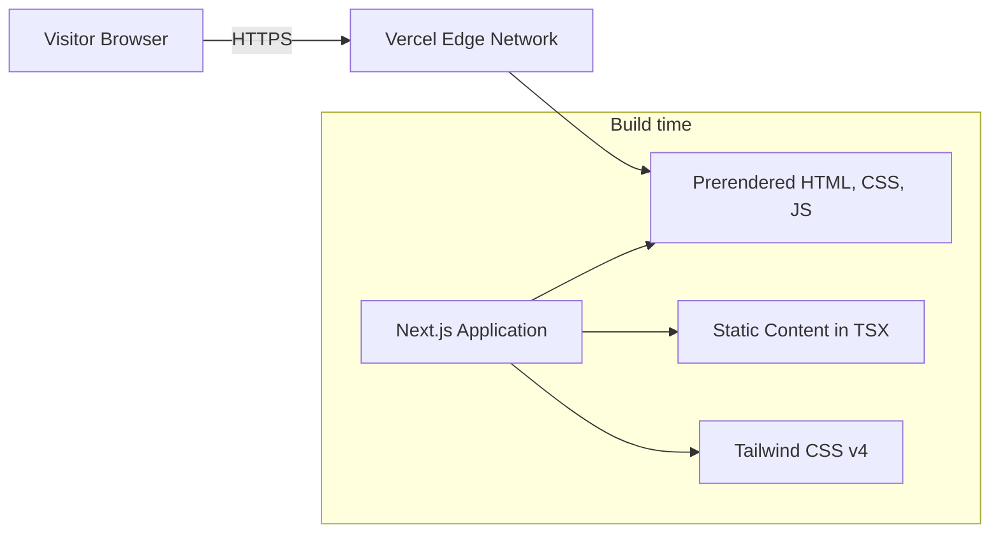
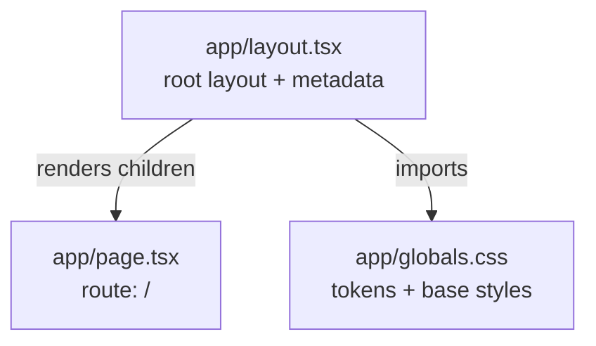
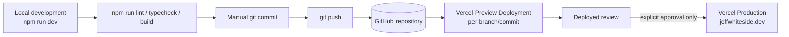

# Architecture

This document describes the architecture **as it currently exists**, not as it is planned.
It is updated in the same iteration as any architectural change.

Current state: **Iteration 1 — foundation only.** The application renders a single
placeholder page. Site sections and reusable components do not exist yet.

## System context

The site is a static, self-contained document. It has no backend of its own, reads no
database, and calls no external service at runtime.

Outbound links to LinkedIn, email, GitHub, and live project applications are introduced in
later iterations and will be added to this diagram when they exist.

## Technology stack

| Layer      | Choice                     | Version |
| ---------- | -------------------------- | ------- |
| Framework  | Next.js (App Router)       | 16.3.0  |
| UI runtime | React                      | 19.2.8  |
| Language   | TypeScript (`strict: true`)| 5.x     |
| Styling    | Tailwind CSS               | 4.x     |
| Linting    | ESLint (flat config)       | 9.x     |
| Hosting    | Vercel                     | —       |

There are exactly three runtime dependencies: `next`, `react`, `react-dom`. Everything else
is a development dependency. See [adr/0001-use-nextjs.md](adr/0001-use-nextjs.md) and
[adr/0002-use-tailwind-css.md](adr/0002-use-tailwind-css.md).

## Rendering approach

All pages are **statically prerendered at build time** (SSG). There is no per-request
rendering, no data fetching, and no runtime environment configuration.

Every component is a **React Server Component**. No `"use client"` boundary exists yet. This
is a deliberate default: client components will be introduced only where interactivity
genuinely requires them, keeping the shipped JavaScript minimal.

Because the output is static HTML, the site can be served entirely from Vercel's CDN.

## Routing approach

The App Router is used with a single route.

- `src/app/layout.tsx` is the **root layout**. It renders `<html>` and `<body>`, imports the
  global stylesheet, and exports the site `metadata` object. Every route is wrapped by it.
- `src/app/page.tsx` is the route segment for `/`.

Version 1 is a single page. Navigation between sections uses in-page anchors rather than
routes, so no additional route segments are planned. See
[adr/0003-use-static-content-for-v1.md](adr/0003-use-static-content-for-v1.md).

Next.js 16 supplies generated global types such as `LayoutProps<"/">`, which type the layout
props against the actual route tree. These are generated into `.next/types` during build and
dev, which is why `tsconfig.json` includes those paths.

Because `.next/` is gitignored, those types are absent on a clean checkout, and a bare
`tsc --noEmit` would fail with `Cannot find name 'LayoutProps'`. The `typecheck` script
therefore runs `next typegen` first. This is why the script is not simply `tsc --noEmit`.

## Application structure

The structure is deliberately flat at this stage. A `src/components/` directory is introduced
in Iteration 2, when there is a second consumer for shared markup — not before.

## Component organization

Not yet established. Iteration 1 contains only the root layout and one placeholder page.

The intended approach, to be implemented in Iteration 2: small, presentational Server
Components, one per site section, composed by `page.tsx`. Sections stay independently
extractable so any of them can become its own route later without restructuring.

## Content organization

Content currently lives inline in TSX. There is no content layer, no Markdown pipeline, and
no CMS.

Content will be extracted into typed modules only where it materially improves
maintainability — for example, a list of experience entries or projects that a component maps
over. Prose that appears exactly once stays inline in the component that renders it.

## Styling approach

Tailwind CSS v4, configured **CSS-first**. There is no `tailwind.config.ts`; Tailwind v4 reads
its configuration from the stylesheet itself.

`src/app/globals.css` contains:

1. `@import "tailwindcss";`
2. An `@theme` block declaring design tokens. Tokens registered here automatically become
   utilities — `--color-ink` yields `text-ink`, `bg-ink`, and `border-ink`.
3. An `@layer base` block with body defaults and a global `:focus-visible` outline.

Current tokens:

| Token                   | Value     | Role                                  |
| ----------------------- | --------- | ------------------------------------- |
| `--color-canvas`        | `#fbfaf8` | Warm off-white page background        |
| `--color-surface`       | `#ffffff` | Raised surfaces                       |
| `--color-ink`           | `#1c1b19` | Primary text                          |
| `--color-muted`         | `#5c5a54` | Secondary text                        |
| `--color-line`          | `#e4e0d9` | Borders and rules                     |
| `--color-accent`        | `#12655c` | Single accent — links, emphasis       |
| `--color-accent-strong` | `#0d4f48` | Accent hover/active                   |

Contrast against `--color-canvas`: ink 16.7:1, muted 6.7:1, accent 6.7:1 — all meet WCAG AA
for normal text.

Typography currently uses a system font stack. The final typographic system is decided in
Iteration 2.

Keyboard focus is handled globally by a single `:focus-visible` rule so that no component can
accidentally ship without a visible focus state.

## Deployment model

Characteristics:

- Vercel builds from the Git repository. Every push produces an immutable preview deployment
  at its own URL.
- Build command is the default `npm run build`. No custom Vercel configuration and no
  `vercel.json` are required.
- No environment variables and no secrets are used by the application.
- Production is promoted only on explicit approval (Iteration 9). Preview deployments never
  affect `jeffwhiteside.dev`.

## External dependencies

**Build time:** npm registry, Next.js, React, Tailwind CSS, ESLint, TypeScript.

**Run time:** none. The served page makes no third-party requests — no fonts, analytics,
tag managers, embedded media, or API calls.

## Security and privacy considerations

- **No data collection.** No analytics, no cookies, no tracking, no forms, no client-side
  storage. There is nothing to breach and no consent banner is required.
- **No secrets.** The repository contains no credentials or environment variables. Nothing
  needs to be kept out of version control except `.project/`, which holds local notes.
- **Static attack surface.** No server-side code paths, no user input, no database.
- **Public contact details are intentional.** Email and LinkedIn are published deliberately;
  the phone number is not published.
- **Transport security** is provided by Vercel — HTTPS with automatic certificate management.
- **Outbound links** to third-party sites will use `rel="noopener noreferrer"` where they open
  in a new tab.

## Current limitations

- The site renders a placeholder page; no real content exists yet.
- No favicon or Open Graph image (Iteration 9).
- Open Graph metadata omits an image, so link previews are currently text-only.
- No automated tests. Given a static page with no logic, lint plus a type-checked production
  build is the proportionate quality gate.
- No sitemap or `robots.txt` yet.
- Light theme only, by design.

## Future architecture considerations

Recorded for context. None of these are being prepared for or partially built.

- **Multiple routes.** If sections grow into detail pages, each becomes its own App Router
  segment. Keeping sections as self-contained components preserves this option cheaply.
- **A content layer.** If content volume grows, typed content modules or MDX would be the next
  step — still without a CMS.
- **A blog.** Would most likely justify MDX and a `content/` directory. Deferred.
- **Dark mode.** The token layer is already the correct seam: a `prefers-color-scheme` block
  overriding the `@theme` variables would cover most of it. Deferred; no partial support
  exists today.
- **Analytics.** If ever added, a privacy-preserving option would be preferred, and it would
  change the privacy posture described above.
